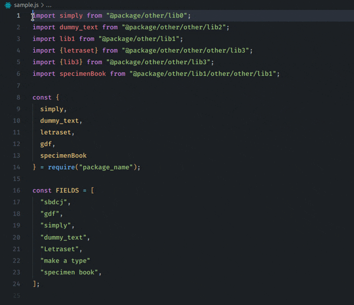
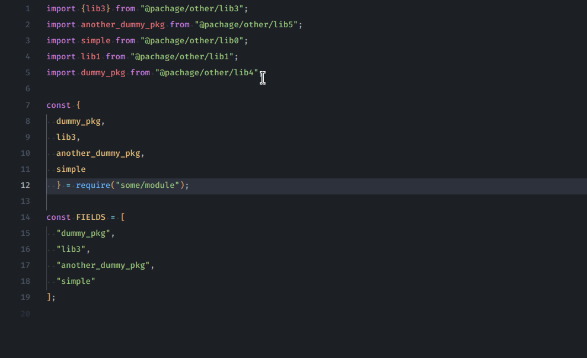

#  Ordinator 

### The easiest way to sort any selection you have in your project, whether it's your imports, exports or any other selection

## Usage 📚

#### Order line with vertical selection. (vscode vertical selection) 📏

#### Order line with normal selection. (mouse or selection) 🖱️

### Default Keymap ⌨️

**Win/Linux:**  
<kbd>ctrl</kbd> + <kbd>alt</kbd> + <kbd>O</kbd>  
<kbd>ctrl</kbd> + <kbd>shift</kbd> + <kbd>O</kbd> => Order

**Mac:**  
<kbd>cmd</kbd> + <kbd>alt</kbd> + <kbd>O</kbd>  
<kbd>cmd</kbd> + <kbd>shift</kbd> + <kbd>O</kbd> => Order

## Contributors 👥

* [Thiago P. Santos](https://github.com/thiagopsnfg/)
* [Gabriel Gouvêa](https://github.com/gouveags)

## LICENSE 📄

[LICENSE](./LICENSE)

**Enjoy!** 🎉
